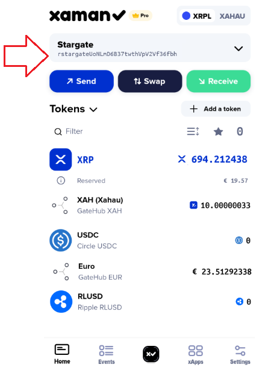

# Sending tokens to Xaman

### **Introduction**

If you are new to Xaman, it can be a little bit confusing to understand what all the buttons and features do. Trust us when we say, **it does get easier** after a little bit of practice! 😉

This article talks about how to send tokens to Xaman.

### **First things first...**

All tokens issued on the XRP Ledger should be sent to your r-address. For example, if someone wants to send XRP to your account, they would send it to your r-address. which you can find here:

<figure><figcaption></figcaption></figure>


Of course, your r-address will be different than our r-address. Our account is a [Vanity r-address](../xaman-pro/features-of-pro/vanity-addresses.md).


Similarly, if you want to send a token to your account, your would send it **to your r-address**.

The second thing to know as that you **can not receive tokens** unless you have configured a Trust Line for those tokens.

In our case, if you look at the picture above, we have several Trust Lines configured in our account:

* XAH (Xahau)
* USDC
* Euros (issued by GateHub)
* RLUSD

This means that we can receive and hold these tokens in our account.

### Putting it together

Let's go through an example of how it works.

Our friend wants to send us tokens. (In this case, to this account: **rstargateUoNLmD6837twth...**)

We can receive XAH, USDC, Euros (issued by GateHub) or RLUSD tokens because we have Trust Lines configured for those tokens.

Our friend has their own XRP Ledger account.

<figure><figcaption></figcaption></figure>

We can see that they have XAH tokens (issued by GateHub) just like we do, and they have Euro tokens (issued by GateHub) like us.

They are going to send us 10 Euro tokens.

First, our friend taps the '**Send**' button.

<figure><figcaption></figcaption></figure>

then they press the **down arrow** in the 'Token' arrow section and select **Euro** (issued by GateHub), then they enter '10' in the 'Amount' field, then press the '**Next**' button.

<figure><figcaption></figcaption></figure>

Now it's time for our friend to enter **our r-address** since we will be the recipient of the tokens. After our complete r-address has been entered, they will press the '**Next**' button.

<figure><figcaption></figcaption></figure>

Finally, we have the Summary screen. Our friend will review the transaction, then slide the '**Slide to send**' button to complete the transaction.

<figure><figcaption></figcaption></figure>

### Frequently Asked Questions

**I receive this message when I try to send tokens:**

<figure><figcaption></figcaption></figure>

The person who you are sending tokens to must have a Trust Line setup for the same token. If you are getting that message, the recipient does not have a Trust Line setup for the token you are trying to send.

**How to I setup a Trust Line for a token?**

This article explains how to do this:


[how-to-create-a-trust-line.md](how-to-create-a-trust-line.md)


**Does each token have a different issuing r-address?**

Yes. There are over 50,000 tokens on the XRP Ledger and each one has its own, unique issuing r-address.

For more information about Trust Lines and how they work, check out this link:

* [All about Trust Lines](https://xrpl.org/trust-lines-and-issuing.html#trust-lines-and-issuing)


One final note, you should never send tokens back to an issuing account. Doing this will destroy them. If you are unsure about this, please contact us to discuss.

