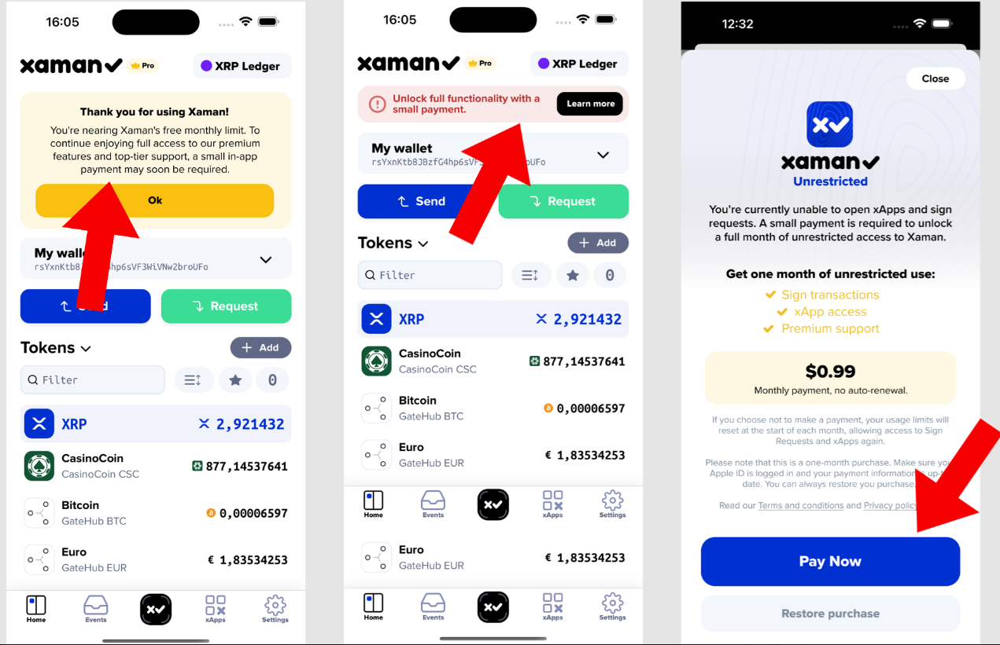

# Understanding monetization

### How Does Monetization Work?

Our monetization model is designed to be fair and inclusive, ensuring casual users can continue to enjoy Xaman for free while power users and businesses contribute to our sustainability.

Here are the key elements:

1. **Usage Based Charging**

* The usage threshold is dynamic. It is calculated based on the average usage of all Xaman users each month, ensuring fairness and adaptability.
* After exceeding the usage threshold, advanced features may require a nominal fee.
* The usage threshold resets every month.
* Using the '**Send**' button remains free for all users, ensuring essential functionality is always available.
* Users can access Xaman for free up to a certain monthly activity level.

2. **Monthly Subscription: Xaman Pro**

* For unlimited usage, users can [**subscribe to Xaman Pro**](../xaman-pro-beta/how-to-subscribe-to-pro.md) for a flat annual rate.
* Pro subscribers are exempt from threshold-based charges and enjoy uninterrupted access to all features.

This dual approach ensures casual users are not burdened while giving power users the flexibility to choose the plan that best suits their needs.

For more details on our monetization model, visit our[ Monetization Blog](https://xaman.app/blog/building-a-sustainable-future-for-xaman-introducing-monetization-and-revenue-sharing).

### Why Xaman Introduced Monetization: Ensuring Sustainability and Growth

Xaman has become a cornerstone of the XRP Ledger (XRPL) ecosystem, trusted by users and developers for its security, innovation, and user-first approach. From the beginning, grants and community support have been instrumental in building Xaman into one of the most vital wallets on the XRPL. However, as the ecosystem grows, sustainability has become critical.

To ensure Xaman remains resilient, innovative, and secure, we’ve introduced a monetization model that allows us to grow independently while continuing to deliver the high-quality features and support you deserve.

This knowledge base article will address why we introduced monetization, how it works, what it means for users, and the steps to take if you choose to move your account to another platform.

<figure><figcaption></figcaption></figure>

***

### Why Did Xaman Introduce Monetization?

The decision to monetize was not taken lightly. Here’s why we believe it’s the right step for Xaman and the XRPL ecosystem:

1. Ensuring Sustainability\
   Grants and donations, while valuable, are unpredictable. Monetization ensures Xaman has a reliable revenue stream to support ongoing development, reducing dependency on external funding and enabling us to plan for the long term.
2. Driving Quality and Innovation\
   Monetization allows us to reinvest in Xaman, accelerating the pace of updates, testing, and new feature rollouts. This ensures users always have access to cutting-edge tools that meet the highest quality standards.
3. A Thriving Ecosystem\
   For the XRPL ecosystem to grow, projects like Xaman need to be self-sufficient. Monetization sets a precedent for building robust, interconnected platforms that can innovate and flourish without external reliance.
4. Enhanced User Support\
   Sustainable revenue allows us to expand and strengthen our support infrastructure, ensuring timely and effective assistance for all users.

***

### What If I Choose to Leave Xaman?

If you decide that Xaman no longer meets your needs, you have two options:

1\) Transfer your funds to a **Centralized Exchange** (Moderate Risk)

You can transfer your XRP to a centralized exchange, but this comes with moderate risks. Centralized platforms have a history of breaches and failures, making user assets vulnerable.


[sending-tokens-from-xumm.md](sending-tokens-from-xumm.md)


2\) Transfer your XRPL account to another **Self-Custodial Wallet** (Safer Option)

You can import your wallet into another trusted self-custodial solution using your private keys.


[moving-your-xrpl-account-to-another-wallet.md](../learning-more-about-xumm/moving-your-xrpl-account-to-another-wallet.md)



Important: Only use verified, reputable wallets to avoid scams. Double-check the wallet’s authenticity before proceeding.


We remain committed to providing the safest, most reliable self-custodial wallet experience for XRPL users. However, if you choose to move on, we encourage you to do so responsibly.

***

## Frequently asked questions

#### How are threshold usage levels determined?

The fees are calculated using various factors but itl boils down to how active your are on Xaman and your account value.

For example:

A) Are you a long term investor who uses Xaman to check their balance once a month?&#x20;

In these cases, Xaman will remain free to use since you rarely use the app.

B) Are you a long term investor who uses Xaman to check their balance every day, once an hour?&#x20;

At some point you will notified you are approaching "above average use" and be asked to pay to continue using Xaman. Checking user balance once an hour would be considered above average user.

#### Is there a lifetime subscription option?

No, currently we only offer monthly and yearly payment options.&#x20;

For an unlimited access to Xaman for 1 year, you can subscribe to Xaman Pro:


[how-to-subscribe-to-pro.md](../xaman-pro-beta/how-to-subscribe-to-pro.md)


#### Do I have to subscribe to Xaman Pro?

No, you can continue to use Xaman for free. If you eventually reach the usage threshold, you will be prompted to make a payment. You do not need to subscribe to Xaman Pro unless you would like unlimited access for 1 year.

#### What are my payment options?

We accept **Google Pay** and **Apple Pay**.&#x20;

**Can I pay in XRP?**

Not currently. No.&#x20;

&#x20;&#x20;

