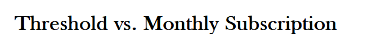

# Understanding monetization

### Why monetize now?

Until now, Xaman has existed largely on grants, donations, subscription revenue (Xaman Pro) and hardware wallet sales. (Xaman Tangem cards) Beginning in Xaman v3.0, we are introducing a new monetization strategy to ensure that we remain viable without relying on grants, donations and hardware wallet sales.&#x20;

This new monetization strategy should allow us to:

* _**Ensure Sustainability**_: Build a lasting ecosystem that financially supports itself, reducing our dependency on fluctuating grants and donations.
* _**Drive Quality and Innovation**_: Utilize the profits generated for development, testing, and deployment costs for continuous support, improvements, and new features.
* _**Enhance Ecosystem Support**_: Strengthen our customer support infrastructure to provide timely and practical assistance, especially for users with higher needs.

By introducing monetization, we are securing our future and ensuring that users continue to receive high-quality updates, faster support, and access to innovative features that enhance their experience.

If you are interested in learning more about our plans, check out this blog for additional details:



### It all started in Xaman v3.0....

Beginning in Xaman v3.0, we have introduced our monetization strategy.

It is based on two models:

<figure><figcaption></figcaption></figure>

## Threshold&#x20;

All users can continue to use Xaman for free until a certain monthly usage threshold has been reached at which time, users will be able to purchase additional usage.&#x20;

1\) Users will receive a usage notification as the approach the threshold.

2\) When the usage threshold is reached, users will still be able to make payments using Xaman but **sign requests** will require a fiat payment in order to process.&#x20;

3\) After a payment has been made, the user will receive **30 days** of **unlimited** use.

4\) 30 days after the payment, Xaman will remain free to use until the monthly usage threshold is exceed again.

5\) If the user declines to make a payment when notified, the threshold for usage will reset every 30 days.&#x20;

## Monthly Subscription&#x20;

Any of our users can subscribe to our Xaman Pro service.

All Pro subscribers will have unlimited use of Xaman for the period of 1 year.

## Frequently asked questions

#### How are threshold usage levels determined?

The fees are calculated using various factors but it will all boil down to above average use and value.

For example:

A) Are you a long term investor who uses Xaman to check their balance once a month?&#x20;

In these cases, Xaman will remain free to use since you rarely use Xaman.

B) Are you a long term investor who uses Xaman to check their balance every day, once an hour?&#x20;

At some point you will notified you are approaching "above average use" and be asked to pay to continue using Xaman. Checking user balance once an hour would be considered above average user.

#### I don't like the idea of having to pay. What are my options?

Our goal is to keep the XRPL ecosystem healthy. The usage fees will be kept low and fairly priced. If you have concerns about our fees, please feel free to contact us via the Xaman Support xApp.

#### I have already subscribed to Xaman Pro. How does this apply to me?

The fees are calculated using various factors

\

##

## How Monthly Subscription&#x20;

Any of our users can subscribe to our Xaman Pro service.

All Pro subscribers will have unlimited use of Xaman for the period of 1 year.

> TL;DR: no details: a low, fair price to keep the ecosystem healthy, after more than average use and value from the app.

although it's hard to share little information :P But I think we can get away with explaining that above average use and value, and the price, are things not equal to everyone. Even based on geographical location, prices, taxes, overhead costs, and incomes differ. We don't want to price out lower income countries, we don't feel every kind of above average use is equal.

We want it to be fair, we want it to be sustainable, and as such we may need to make minor changes along the way.

The average time to commute to work in the USA is 26 minutes.

The average time to commute to work in the Autralia is 54 minutes.

