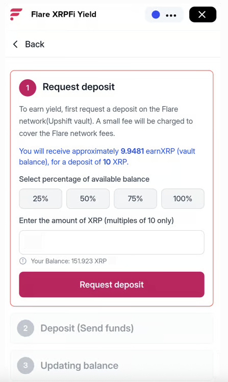

# How to Deposit XRP

1\) Launch Xaman

2\) Tap the **xApp** button at the bottom of the screen.

3\) Tap the **Flare XRPFi Yield** xApp.

<figure><figcaption></figcaption></figure>

4\) You should see the following screen:

<figure><figcaption></figcaption></figure>

5\) Decide how much XRP you would like to invest, then enter the amount into the appropriate field and press the **Request deposit** button.&#x20;

<figure><figcaption></figcaption></figure>

6\) Sign the transaction.

<figure><figcaption></figcaption></figure>

<figure><figcaption></figcaption></figure>

7\)&#x20;
