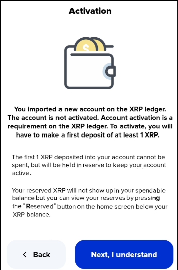
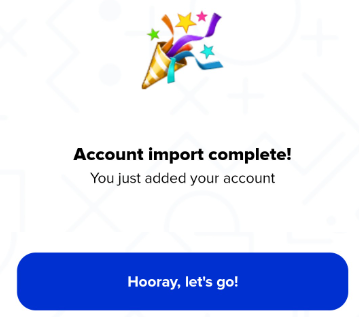

# How to create an XRP Ledger account

If you have just finished installing Xaman (formerly Xumm) and are at this page, start by pressing the **Create a new account** button.

<figure><figcaption></figcaption></figure>

1\) If you are **not** at the above screen, launch Xaman and press **Settings** -> **Accounts** -> **+ Add account** -> **Create a new account**.

<figure><figcaption></figcaption></figure>


Make sure you read and understand this page then press the **Next, I understand** button.


You will be presented with a set of secret numbers. The secret numbers consist of 8 rows, (A through H) with each row containing 6 digits. (0,1,2,3,-> 9)&#x20;

<figure><figcaption></figcaption></figure>

You will need to **carefully** write all of the numbers down in the correct order. These numbers are used to generate your private keys. It is vital that you record these numbers correctly and store them in a safe place. After writing down the first row of numbers, press **Next** to see the following row. Repeat this process until you have recorded all of the secret numbers.

<figure><figcaption></figcaption></figure>

The next part of the process is to manually enter all of the secret numbers back into Xaman. You can use the buttons and the buttons to do this. Once you have successfully re-entered the correct secret numbers, press the **Next** button to continue.\


This step is deliberately time consuming and tendinous. The secret numbers are absolutely vital to the safety of your XRP Ledger account and are **the only way** to access your account in the event something were to happen to your phone.

Please do not take this process lightly and make sure you accurately record and safely store your secret numbers.


<figure><figcaption></figcaption></figure>

You should receive your public address, also known as your r-address. To continue, press the **Next** button.

<figure><figcaption></figcaption></figure>

Press the **Next, I understand** button to continue.

Next you should see the following screen:

<figure><figcaption></figcaption></figure>

The following table should help you decide which option is best for you.

| Option                                                 | Explanation                                                                                                                                                         |
| ------------------------------------------------------ | ------------------------------------------------------------------------------------------------------------------------------------------------------------------- |
|  (2) (3).png>)     | Standard security is a great option your daily spending account. You can sign with your 6 digit passcode or enable biometrics and sign with your face/finger print. |
|  (1) (2) (2).png>) | Extra security allows you to enter a separate signing password. This is the best option for your long term storage account.                                         |

Once you decide, select it and press the **Next** button.

<figure><figcaption></figcaption></figure>

Enter the account label, then touch **Done** and press the **Next** butto&#x6E;**.**

<figure><figcaption></figcaption></figure>

Press the **Hooray, let's go!**

You should now be at the main screen of Xaman.

<figure><figcaption></figcaption></figure>

Notice that your new account has **not been activated** yet.

All XRPL accounts [need to be activated](../how-to-activate-a-new-xrpl-account/) with at least 10 XRP in order to hold XRP in them.

Pressing the **Activate your account** button gets you into the Account Activation flow.

<figure><figcaption></figcaption></figure>

If you press the **Buy XRP** button you will be provided with several options to purchase XRP.

<figure><figcaption></figcaption></figure>

For more information about activating your new XRP Ledger account, please refer to this article:

[**Activating an XRPL account**](../how-to-activate-a-new-xrpl-account/)
