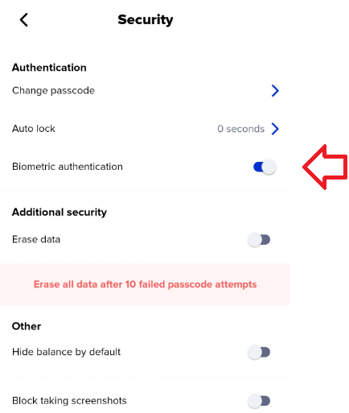

# How to configure biometrics

Biometric authentication is a security process that involves using some part of your physical body to authenticate you. In the case of Xumm, a fingerprint or face scan.&#x20;

## Setting up biometrics

There are couple of things that you should be aware of before you configure Xumm to use biometrics:

* Xumm does not create or store your biometric information. It relies on your phone to manage this data.
* Configuring Xumm to use biometrics does not replace your 6 digit passcode. You can still use your passcode to access Xumm.
* On some older phones, you must configure **both** your fingerprint **and** your face scan on your phone before Xumm will enable biometrics. Configuring one or the other **will not work**.&#x20;
* Some Apple phones, (iphone 12, 13 and 14) do not have the option to setup Touch ID. With those phones, you can only configure Face ID so Xumm will only support Face ID in those cases.&#x20;

## Enabling biometrics in Xumm

As long as you have successfully setup your fingerprint and/or face scan on your phone, enabling biometrics can be easily done by:

1\) Launching Xumm and pressing the **Settings** button.

2\) Tapping the **Security** option.

2\) Tapping the **Biometric authentication** button.

<figure><figcaption></figcaption></figure>

## Biometrics and Xumm security

Once biometrics has been enabled in Xumm, it will continually check the biometric configuration on your phone to see there have been any changes. If the host parameters of biometrics change (e.g. iCloud account security settings updated, fingerprint/face added/removed, etc..) Xumm will  automatically disable biometric authentication and revert exclusively to the six digit passcode configured during the initial installation.\
\
We did this because an attacker with access to your phone might be able to add their own fingerprint to your device, thus granting themselves access not only to your phone but also to your Xumm wallet.)\
\
If this happens, just disable Biometric authentication in Xumm, reboot your phone, then launch Xumm and re-enable Biometric authentication.

## Troubleshoot tips

In many cases, just toggling _**Settings** > **Security** > **Biometric Authentication**_ off then back on is enough to resolve most issues.

**Samsung phones**

On some phones, you may encounter the follow message,

<figure><figcaption></figcaption></figure>

As mentioned above,  you can try configuring **BOTH** a Fingerprint and a Face ID configured.

On most Samsung phones, here is how to configure this:

1\) Go into _**Settings**_ on your phone and select _**Biometrics and security**_.

<figure><figcaption></figcaption></figure>

&#x20;

Make sure you have both face **and** fingerprints setup.

<figure><figcaption></figcaption></figure>

**Notes**

We understand that you might have additional questions regarding this topic so you are welcome to contact us any time via the [<mark style="color:blue;">**Xumm Support xApp**</mark>](https://xumm.app/detect/xapp:xumm.support?ref=helpcenter) in Xumm or you can simply scan this QR code with Xumm and be directed there automatically.

<figure><figcaption></figcaption></figure>
