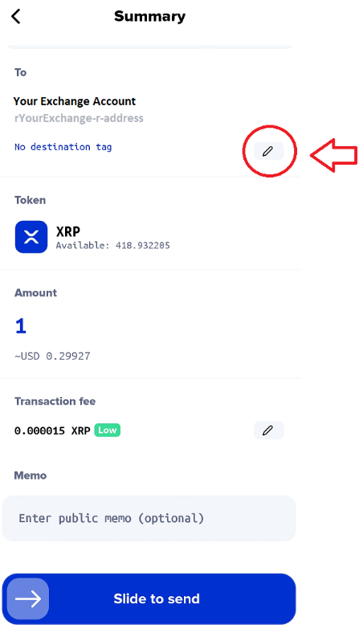

# 📨 Send funds with Xumm

**Introduction**

If you are new to Xumm, it can be a little bit confusing to understand what all the buttons and features do. Trust us when we say, it does get easier after a little bit of practice! 😉

This article talks about how to send funds using Xumm

### **Background**

The first thing to know is that all tokens issued on the XRP Ledger use the same r-address to send and receive as XRP does.

For example, if you want send XRP to your account, you would send it to your r-address. In Xumm you can find your r-address here:

<figure><figcaption>
R-Address
</figcaption></figure>

Now, let’s say you want to send another token to your account, for example, CasinoCoin (CSC), you would send it to the same r-address as you would if you were sending XRP. (In this case, **rAtLaNtiSod5cBiw4vjqtoPBLEbXNg**.)

…and if you wanted to send a different token to your account, maybe, Sologenic (SOLO) or Coreum (CORE) or Elysium (ELS), they would all use the same r-address. (Again, in this case, **rAtLaNtiSod5cBiw4vjqtoPBLEbXNg**.)

In all of the above cases, the relevant Trust Line needs to be set before the token will show as an asset in the destination account.

Here is how to create a Trust Line:

### **Each Trust Line has its own r-address…**

In order to receive and hold a particular XRP Ledger token, (there are over 82010 of them), you need to create a Trust Line to their project.

Let’s look at the CasinoCoin (CSC) project for example.

The CasinoCoin project issued the CSC token back in March of 2021 from this r-address:

**rCSCManTZ8ME9EoLrSHHYKW8PPwWMgkwr**

If you would like to own CSC tokens, you will need to create a Trust Line to their issuing account. When you create a Trust Line, you are basically saying that you have researched their project and are satisfied that they are a trustworthy company.

For more information about Trust Lines and how they work, check out this link:

* [All about Trust Lines](https://xrpl.org/trust-lines-and-issuing.html#trust-lines-and-issuing)

### **Sending funds using Xumm**

Now that you know where to send your assets to and you know a bit about how Trust Lines work, you are ready to use Xumm to send funds.

#### **Step 1**

From the main screen in Xumm, press the **Send** button.

<figure><figcaption>
Send Button
</figcaption></figure>

On the following screen, you will see the option to enter the **amount** you would like to send.

(You can also change the account you would like to send the tokens **from** and you can change the **type** of token you would like to send.)

<figure><figcaption></figcaption></figure>

In our case, we are going to send 1 XRP from our account.

Press the **Next** button to continue.

**Step 2**

In this screen you can enter the **recipient's** account that you are sending your tokens to.

Keep in mind, there are two types of accounts on the XRPL.

* **Non custodial** accounts - You are solely responsible for managing your private keys.
* **Custodial** accounts - A company is responsible for managing the private keys to their account. (Usually a crypto exchange.) You are assigned an account number with the exchange called a destination tag.

Both types of accounts will have an r-address but a custodial account will also require a destination tag. (More about destination tags later.)

Press **Next** after you have entered/selected the correct destination r-address.

<figure><figcaption>
Recipient screen
</figcaption></figure>

**Step 3**

Finally we reach the **Summary** screen. Here you can review your transaction to make sure it is correct.

<figure><figcaption></figcaption></figure>

If you are sending to a non-custodial account, you can simply **Slide to send** and your transaction will be sent to the XRP Ledger to process.

However, if you are sending to a **custodial** account, (ie. an exchange account) this where you would enter your **destination tag**.

<figure><figcaption></figcaption></figure>


Remember, non-custodial accounts, like the ones managed with Xumm **do not** require destination tags. Only **custodial** accounts require them.


#### **A little bit more about destination tags**

You may have noticed that most crypto exchanges have **one** receiving r-address for **all** of their XRP customers? Have you ever wondered how thousands of customers can use just one XRP account?&#x20;

When you create an account with a crypto exchange, they issue you a customer account on their internal database. They also create a destination tag which points to your new customer account and they provide you with **their** XRP Ledger account which you can send and receive XRP. You do not own their XRPL account. They have complete control over it. Since thousands of customers are sending funds to and from the same XRPL account, the only way they can tell which funds belong to which customer is by the destination tag included in each transaction. &#x20;

You can lean more about destination tags in this video:

* [All about destination tags](https://www.youtube.com/watch?v=gAWnIw4gzW8)

**Additional reading**

* [What is the destination tag for your XRP Ledger account managed with XUMM?](https://support.xumm.app/hc/en-us/articles/360018135860)
* [What to do When a Deposit to an Exchange Didn’t Arrive](https://support.xumm.app/hc/en-us/articles/360018433819)
* [An introduction to Destination Tags](https://support.xumm.app/hc/en-us/articles/360018134720)

**Notes**

We understand that you might have additional questions regarding this topic so you are welcome to contact us any time via the **Xumm Support xApp** in Xumm or you can simply scan this QR code with Xumm and be directed there automatically.

<figure><figcaption></figcaption></figure>
