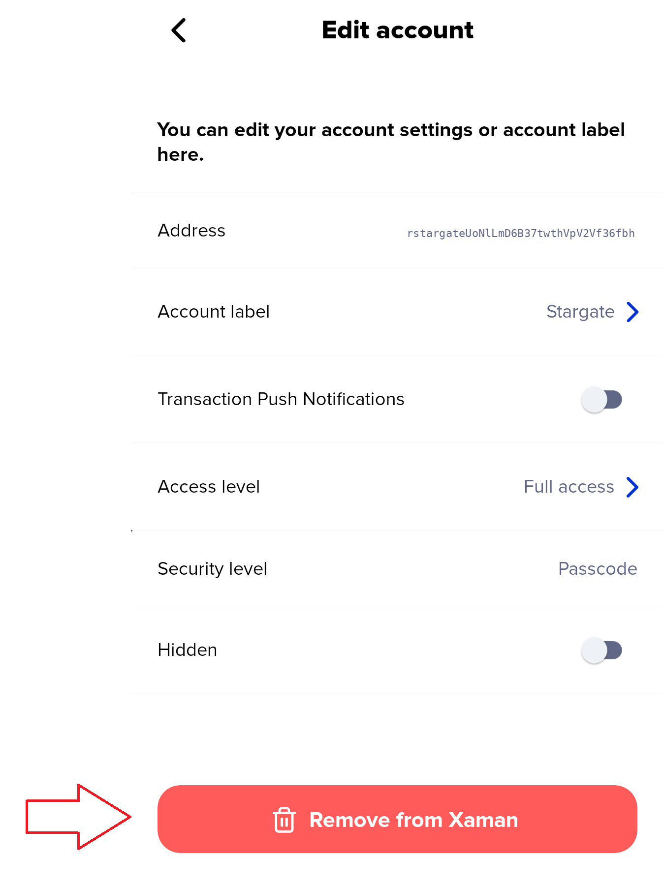

# How to remove an account from Xaman

Removing an account from Xaman deletes it from the device only. Your account still exists on the XRP Ledger with your funds, tokens, and transaction history intact. You can always access it again by importing your account secret back into Xaman.


Before you remove an account, make sure you have its **account secret** (Secret Numbers, Family Seed, or Mnemonic) written down somewhere safe. It's also a good idea to check that it is the correct one for your account. See: [How to test your Account Secret](learning-more-about-xaman/how-to-test-your-account-secret.md)&#x20;


***

### Steps

1. Open Xaman and tap **Settings**.
2. Tap **Accounts**.
3. Tap **Edit** on the account you want to remove.

<figure><figcaption></figcaption></figure>

4. Scroll to the bottom and tap **Remove from Xaman** (red button).

<figure><figcaption></figcaption></figure>

5. A warning appears:

> **Warning** Your account will be deleted permanently from Xaman. Are you sure?

6. **Full-access accounts** (imported with a secret or a Tangem card): you'll be asked to enter your 6-digit passcode. Biometrics are not offered at this step. **Read-only accounts:** no passcode is needed.
7. Tap **Yes, I'm sure**.

The account is removed and you are returned to the Accounts list.

***

### How to get the account back

Open Xaman, tap **Settings** → **Accounts** → **+ Add account** → **Import an existing account** → **Full access**, then choose your account secret (Secret Numbers, Family Seed, or Mnemonic) and follow the instructions on the screen. You'll be logged back into the **same** r-address with the same balance and history. It's not a new account — it's the same one.

For Xaman card accounts, open Xaman, tap **Settings** → **Accounts** → **+ Add account** → **Add a Tangem card,** then scan your card. (See [Importing your account](https://help.xaman.app/app/getting-started-with-xaman/importing-your-account)).

***

### Removing an account vs. uninstalling the app

|                        | Remove an account                  | Uninstall the app                 |
| ---------------------- | ---------------------------------- | --------------------------------- |
| Scope                  | One XRPL account managed wit Xaman | All XRPL accounts manged by Xaman |
| Funds on the ledger    | Unaffected                         | Unaffected                        |
| Address Book           | Unaffected                         | Wiped                             |
| Support tickets in-app | Unaffected                         | No longer accessible              |
| Re-import needed       | Only the removed account           | Every account                     |
| Passcode               | Unchanged                          | Reset on reinstall                |

***

### Frequently Asked Questions

**Will I lose my funds?** \
No. Removing an account from Xaman is a local operation. Your XRP and tokens stay in your account on the XRP Ledger. The account, balance, and history are all still there, you just can't see them from Xaman until you re-import your account secret.

**Can I undo the removal?**\
No. There's no "undo" option or trash bin. You can re-import your account secret if you would like to access your account again.

**Do I need my passcode to remove an account?**\
If your account was imported with full-access, (imported with an account secret or a Xaman card), then yes, you need to know your passcode. If your account was imported in read-only mode, then no, you do not need to know your passcode.

**What happens to my transaction history?**\
Transaction history lives on the XRP Ledger, not in the app. It's not deleted from the XRPL when you remove your account from Xaman. If you re-import the account secret for your account, the full history will be visible again.

**Does removing a Xaman card account affect the card?**\
No. Neither the card itself nor the account is affected. You can re-import it into Xaman at any time.

**I removed an account and now I can't find its address. Is it gone?**\
The address is gone from your Xaman app, but the account still exists on the XRP Ledger. If you have the account secret for the account, you can re-import it into Xaman and you will see it again.&#x20;
