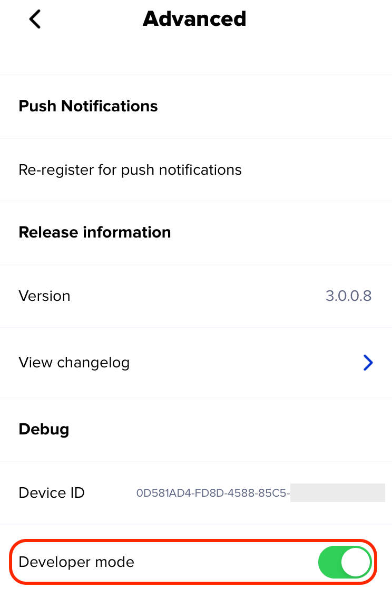
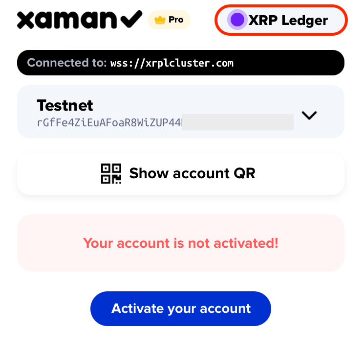
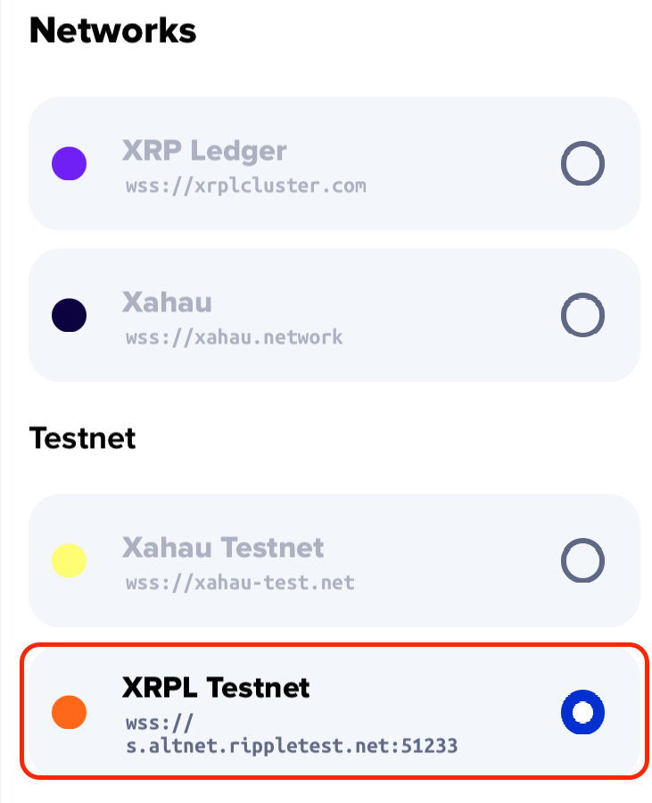
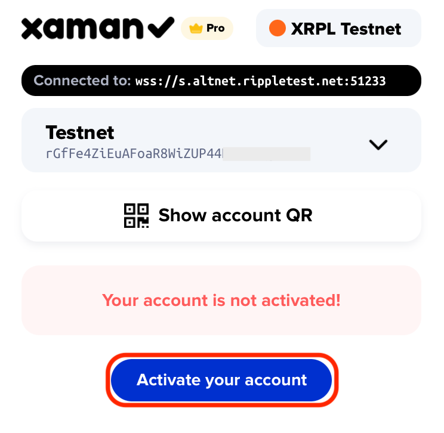
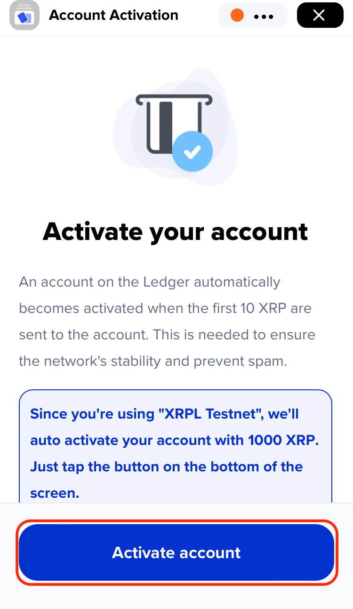
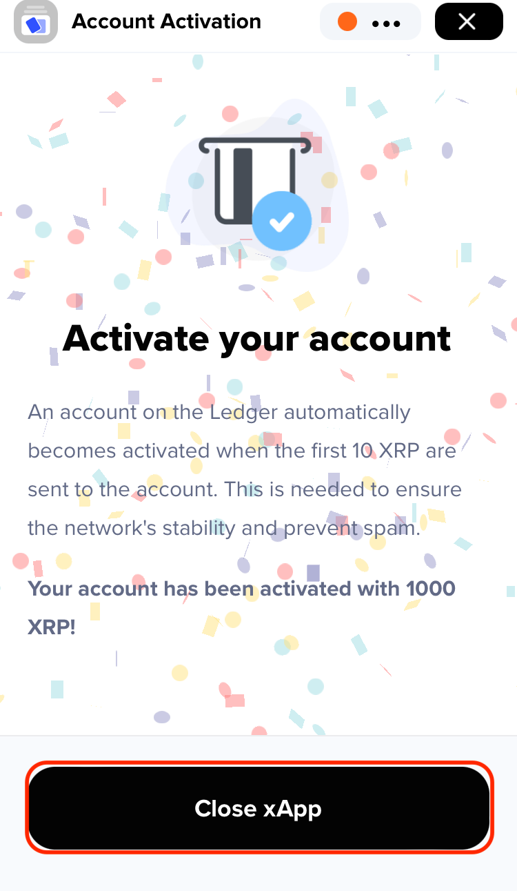
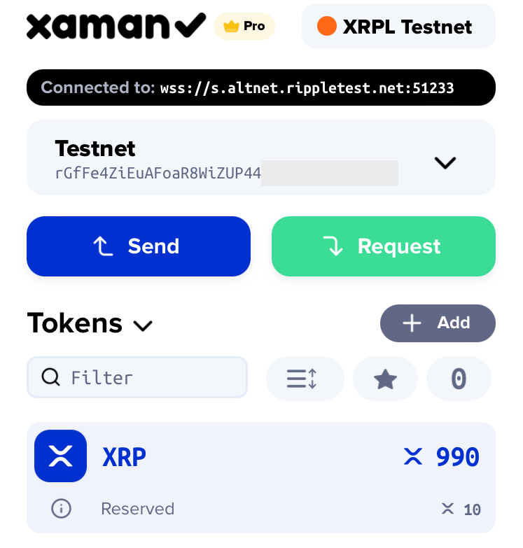

# How to access Testnet on XRP Ledger

\
How to access Testnet on XRP Ledger
-----------------------------------

It’s always important to fully understand how you’re interacting with the XRP Ledger. With complex features on XRPL, we strongly recommend users try them out on the testnet first. \
In this article, we'll guide you through the process of setting up your account on Testnet.

### Why we recommend 

Using the testnet before the mainnet comes with several benefits. It lets you safely test applications without risking real assets since **tokens on the testnet don't have any real value.** You can also experiment with changing settings for your account without affecting your actual account on the mainnet.

### Instructions 

1.  Open Xaman, go to Settings > Advanced > (scroll down a little) then enable "Developer mode" then go back to the previous screen. 

    <figure><figcaption></figcaption></figure>
2.  Tap **Home** button at the bottom of the screen, then press the network switch button at the top right. 

    <figure><figcaption></figcaption></figure>
3.  Select XRPL Testnet under the Testnet category. 

    <figure><figcaption></figcaption></figure>
4.  Go back to the home screen, then select **Activate your account** 

    <figure><figcaption></figcaption></figure>
5.  On the next screen, press **Activate account** button. 

    <figure><figcaption></figcaption></figure>
6.  Once your account is funded, select **Close xApp** 

    <figure><figcaption></figcaption></figure>
7.  You should see your account on Testnet is funded with 1,000 XRP. \
    Again, **these tokens have no real value.** 

    <figure><figcaption></figcaption></figure>

Now you're all set to try out all the features without affecting the real accounts on mainnet!

Open any xApp you’d like to test, and you can explore and experiment as much as you want until you're comfortable.&#x20;
