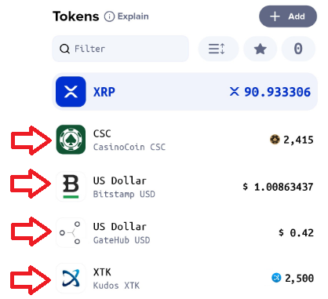

# Adding an Icon/Logo to a Trust Line in Xumm

### **Background**

Trust Lines are a fundamental part of the XRP Ledger in that they allow an account to hold non-XRP assets (tokens) issued on the XRPL.

Each Trust Line has a unique r-address which helps to identify it but it can be confusing for new users and sometimes people mix up the various tokens and issuing accounts.

Here at Xumm we are constantly trying to make things safer and easier for our users so we are excited to introduce **Trust Line icons** for all token issuers on the XRPL. It is our hope that by adding icons to Trust Lines, it will help our people quickly and accurately identity which projects they are dealing with.

### **How do I get my icon/logo to show on the Trust Line list in Xumm?**

When we talk about the Trust Line icons in Xumm, we are talking about the little logo beside the Trust Line name. Here are some examples:

<figure><figcaption></figcaption></figure>

Xumm fetches all token information (including icons/logos) from the [**xrplmeta.org**](http://xrplmeta.org) project.

You can find the setup instructions here: [**xrplmeta.org**](http://xrplmeta.org)&#x20;

If you need assistance with the instructions, xrplmeta.org can be reached here:

[https://twitter.com/xrplmeta](https://twitter.com/xrplmeta)

### **What exactly are the requirements to get an icon/logo added in Xumm?**

[Xrplmeta.org](http://xrplmeta.org) is an external data feed that Xumm references for token attributes.

Your project must also feature these traits as reflected by the data we retrieve from them.

* At least _“trust level 1”_ on [**xrplmeta.org**](http://xrplmeta.org)
* Token name
* Token issuers name
* Token issuer domain name
* Have a non-trivial number of incoming Trust Lines for your asset
* Have a non-trivial amount of asset holders for your asset
* Completed [the XRPL Foundation](https://foundation.xrpl.org/token-assessment-framework/) [Self Assessment](https://foundation.xrpl.org/token-assessment-framework/)

Once you have completed all of the above, your icon is _eligible_ to be displayed in Xumm.

### **Is there anything else I need to know?**

Yes, here are a couple of other things you should be aware of:

1. Adding a Trust Line icon **does not** mean that Xumm endorses the asset in question. Xumm will still show users the **appropriate warnings** when **adding Trust Lines.**
2. We do not endorse or support ANY token issued on the XRPL. Xumm is simply displaying your icon information that is publicly available by 3rd party data feeds.
3. Adding an icon to a Trust Line icon **DOES NOT** add the asset to the Xumm short list.
4. We only _publish_ token icons from the XRPL Meta API. Xumm does not sync the information.

### **How often does Xumm refresh / update the icon information?**

Once every 24 hours Xumm will fetch the feeds and update the information in the app based on meeting the above requirements. (We can’t speak for the feed refresh policies for the XRPL Foundation or [Xrplmeta.org](http://xrplmeta.org) though.)

For new, valid assets, Xumm users may need to restart Xumm before they can see them.

As well, issuer icons (add Trust Line, remove Trust Line, Sign Request, Event List) have a 24h cache policy _on a per device, client side_ basis, so depending on the user it may show instantly or after 24h.

**Notes**

We understand that you might have additional questions regarding this topic so you are welcome to contact us any time via the [<mark style="color:blue;">**Xumm Support xApp**</mark>](https://xumm.app/detect/xapp:xumm.support?ref=helpcenter) in Xumm or you can simply scan this QR code with Xumm and be directed there automatically.

<figure><figcaption></figcaption></figure>
