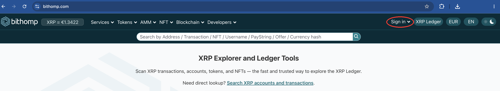

# How to Burn an NFT

The following process **permanently deletes** an NFT and **cannot be undone!**

### Who can burn an NFT

* The current **owner** (holder) of the NFT
* If the NFT was created with the `flagBurnable` flag enabled:
  * The **issuer**, or
  * The issuer's authorized [`NFTokenMinter`](https://xrpl.org/nftoken-authorized-minting.html) account

### Method 1: Bithomp (easiest)

If you already use Bithomp or don't mind connecting your wallet to a third-party site, this is the quickest option.&#x20;

1. Go to [Bithomp](https://bithomp.com/) and connect your Xaman wallet.

<figure><figcaption></figcaption></figure>

2. Find the NFT you want to burn in your collection. It will show the image, name, and Token ID.\
   <br>
3. Tap the red **Burn** button.
4. Review ad sign the transaction in Xaman.

\[Bithomp screenshot showing NFT card with Burn button]

That's it. The NFT is gone.

### Method 2: NFT Burn xApp

A community xApp that lets you burn an NFT directly inside Xaman. You'll need the NFTokenID (64 hex characters).


This is a community xApp (made by XRPLWin). It is not operated by Xaman.


1. Open the [NFT Burn xApp](https://xumm.app/detect/xapp:xrplwin.nftburn) in Xaman.
2. Paste the NFTokenID.
3. Tap Burn and confirm in Xaman.

To find your NFTokenID, check the NFT details in Xaman or ask support.

### Method 3: Manual (XRPL.Services Raw JSON)

If the above options don't work for you, you can submit the burn transaction manually using XRPL.Services.<br>

1. Sign in to XRPL.Services with the account that owns the NFT.

\[XRPL.Services sign-in screenshot]

Navigate to _XRPL Tools > Raw JSON Transactions > NFTokenBurn Template_.

Update the field values as follows:

| Field       | Description                                                                               |
| ----------- | ----------------------------------------------------------------------------------------- |
| `Account`   | _(Required)_ The address of the account initiating the transaction.                       |
| `Owner`     | _(Optional)_ The owner of the NFToken. Only needed if different from the sending account. |
| `NFTokenID` | _(Required)_ The 64-character NFTokenID to burn.                                          |

N.B. The "Sequence" and "Fee" fields are not present since Xaman handles those.

`{ "TransactionType": "NFTokenBurn", "Account": "rNCFjv8Ek5oDrNiMJ3pw6eLLFtMjZLJnf2", "Owner": "rvYAfWj5gh67oV6fW32ZzP3Aw4Eubs59B", "NFTokenID": "000B013A95F14B0044F78A264E41713C64B5F89242540EE208C3098E00000D65" }`

Remove the `Owner` line if the sender is the owner.

Submit the transaction via the button under the code block.

\[Submit button screenshot]

Update the Memo if necessary, then select **Confirm**.

\[Confirm screenshot]

A QR Code screen appears. In Xaman, respond to the notification or scan the QR code.

\[QR code screenshot]

Slide to Accept. Sign the transaction.

***

### Error Cases

Besides errors that can occur for all transactions, NFTokenBurn can result in:

| Error Code         | Description                                                      |
| ------------------ | ---------------------------------------------------------------- |
| `temDISABLED`      | The NonFungibleTokensV1 amendment is not enabled on the network. |
| `tecNO_ENTRY`      | The specified TokenID was not found (already burned or invalid). |
| `tecNO_PERMISSION` | The account does not have permission to burn this token.         |

Requirements:

* Must be NFT Owner

Or

* if the `NFToken` has the `flagBurnable` flag enabled
  * can be the issuer
  * or the issuer's authorized [`NFTokenMinter` ](https://xrpl.org/nftoken-authorized-minting.html)account instead

1. Sign in to XRPL.Services with the account that owns the NFT

 (3).png>)

Navigate to _XRPL Tools > Raw JSON Transactions > NFTokenBurn Template_

Update the field values to match the requirements of your transaction as follows:

<table data-header-hidden><thead><tr><th width="131"></th><th></th></tr></thead><tbody><tr><td>Field</td><td>Description</td></tr><tr><td><code>Account</code></td><td><em>(Required)</em> The unique address of the <a href="https://xrpl.org/accounts.html">account</a> initiating the transaction.</td></tr><tr><td>Owner</td><td>(Optional) The owner of the NFToken to burn. Only used if that owner is different than the account sending this transaction.</td></tr><tr><td>NFTokenID</td><td><em>(Required)</em> The NFToken to be removed by this transaction.</td></tr></tbody></table>

N.B. The "Sequence" and "Fee" fields are not present since Xaman will take care of this!

```json
{
  "TransactionType": "NFTokenBurn",
  "Account": "rNCFjv8Ek5oDrNiMJ3pw6eLLFtMjZLJnf2",
  "Owner": "rvYAfWj5gh67oV6fW32ZzP3Aw4Eubs59B", //Optional
  "NFTokenID": "000B013A95F14B0044F78A264E41713C64B5F89242540EE208C3098E00000D65"
}
```

Submit the transaction to Xaman via the button under the code

 (6).png>)

Update the Memo if necessary and select Confirm

 (2).png>)

A QR Code screen appears

 (1) (1) (1) (1) (1) (1) (1) (1) (1) (1) (1) (1) (1) (1) (1) (1) (1) (1) (1) (1).png>)

In Xaman, either respond to the notification or scan the QR code to bring up the transaction

Slide to Accept

Sign the transaction

Success or:

### Error Cases <a href="#error-cases" id="error-cases"></a>

Besides errors that can occur for all transactions, NFTokenBurn transactions can result in the following [transaction result codes](https://xrpl.org/transaction-results.html):

| Error Code         | Description                                                                                                     |
| ------------------ | --------------------------------------------------------------------------------------------------------------- |
| `temDISABLED`      | The [NonFungibleTokensV1 amendment](https://xrpl.org/known-amendments.html#nonfungibletokensv1) is not enabled. |
| `tecNO_ENTRY`      | The specified `TokenID` was not found.                                                                          |
| `tecNO_PERMISSION` | The account does not have permission to burn the token.                                                         |
