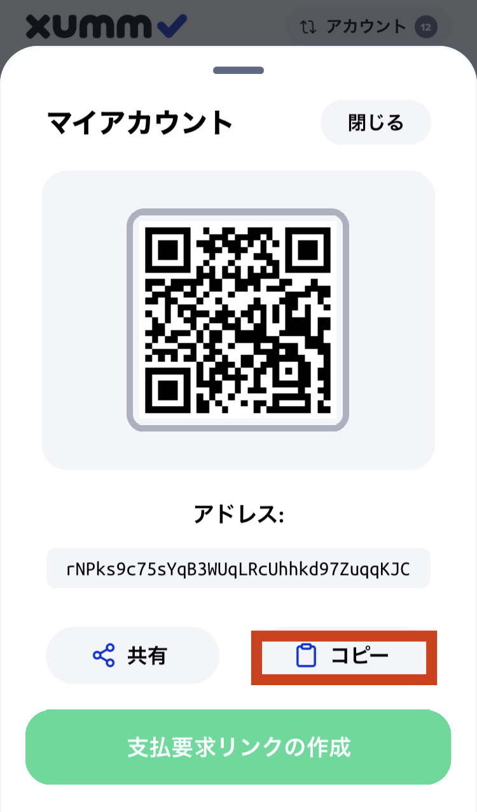

# レギュラーアカウントでXumm Tangemカードアカウントの署名をするには

この記事では通常のレギュラーアカウントがXummタンジェムカードで作成したアカウントの署名をできるようにする設定方法についてご案内します。

#### Step 1: Xummタンジェムカードをインポートする 

手順についてはこちらの記事をご覧ください。

[xumm-tanjemuktonoinpto.md](xummtanjemukdo/xumm-tanjemuktonoinpto.md "mention")

**Step 2: 新しいカードアカウントに10XRPを送金して有効化する**

XRPレジャーでトークンを保有するには準備金として10XRPを入金する必要があります。

有効化についてはこちらの記事をご覧ください。

[akauntowosuru.md](akauntowosuru.md "mention")

**Step 3:  すでにあるレギュラーアカウントのrアドレスをコピーする**

右上の「アカウント」から、バックアップとして利用したい通常のレギュラーアカウントへ切り替え、「受け取る」ボタンを押してアドレスをコピーします。

<figure><figcaption></figcaption></figure>

次にカードアカウントへホーム画面の右上「アカウント」から再度カードアカウントへ切り替え、[XRP Ledger Services](https://xrpl.services/)のサイトへ移ります。

#### Step 4: Xummカードでサインインする 

 ボタンを押し、**Open in the Xumm App** を選択

<figure><figcaption></figcaption></figure>

#### Step 5: カードアカウントにレギュラーキーを設定する 

XRP Ledger Servicesのページ、左側の上から５番目にある**Set Regular Key**をクリックします。

<figure><figcaption></figcaption></figure>

Paste the r-address for your new Xumm card in the field titled, "XRPL address which will be able to sign transactions", then press the **Send Set Regular Key to Xumm** button.

#### Step 6: Sign the transaction with your existing account 

Sign the transaction in Xumm and you're all done!&#x20;

### What is the recommended way to configure my Xumm cards?

The recommended and ideal way to configure a card is to have **two cards**, then "link" them together using the Tangem Backup xApp. This is explained in this article:


[Broken link](broken-reference)


### I only have one card though...

Each card will generate and store an XRP Ledger account secret on the card.

The account secret can not be viewed and extracted from the card and anytime you want to sign transaction on the card's account, you must have the card with you.

This is a great security feature but since the account secret only exists in one place, (on the card) what would happen if you lost or damaged the card? (You would lose access to your funds!)

This is why we only sell a minimum of two cards. With two Xumm cards, you can create a backup card which allows you to access your funds in case one of them is ever lost or damaged.

If you only have one card, "linking" an existing account to it allows your existing account to act as a backup in case something happens to the card.
