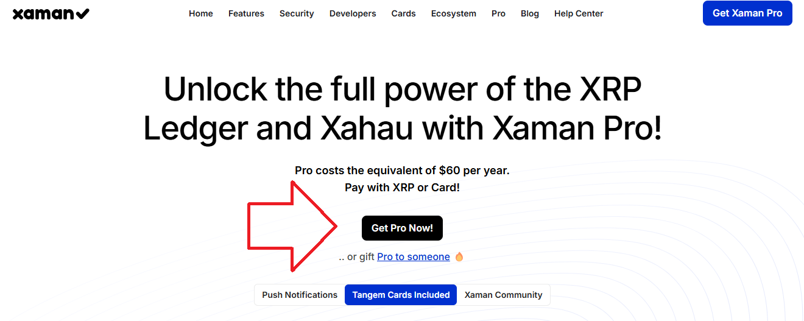

# How to subscribe

### **Background**

Thank you for your interest Xumm Pro. We really do appreciate it! 🤗

In this article we will explore how to subscribe to Xumm Pro (Beta).

For a more in depth look into Xumm Pro, why you should subscribe and the answers to some frequently asked questions, check out this article:


[what-is-xumm-pro.md](all-about-xumm-pro/what-is-xumm-pro.md)


### Understanding the process

In case you're interested, we originally had two different purchase flows in Xumm. (One for Xumm Pro and one for the Xumm (Tangem) cards.) The thing is, Xumm Pro always comes with 2 Xumm cards and when you purchase Xumm cards, they always come with a Pro subscription.  Why have two separate flows when one will do?&#x20;

So you'll notice the subscription process takes you through the Xumm card purchase flow. This is how it was designed to work.&#x20;

### **How to subscribe**

1\) You can order the cards from the [Get cards (Tangem) xApp](https://xumm.app/detect/xapp:xumm.tangem-order) from within Xumm or by launching Xumm, pressing the **xApps** button on the bottom of the screen then choosing **Get cards (Tangem)**.

<figure><figcaption></figcaption></figure>

2\) Next, choose how many cards you'd like to receive along with you Pro subscription. Most people go with the **2 Xumm Tangem Card + Pro** option, but you choose 2,3,4 or 5 depending on your needs. Just press the **Select** under the one you would like.

<figure><figcaption></figcaption></figure>

3\) After filling out your information, you get to the **Payment** section.

<figure><figcaption></figcaption></figure>

Here you have two options to pay.

* Pay with XRP using Xumm
* Pay with USD using a credit card (Note: a 14% premium applies)

We recommend **paying with Xumm using XRP**. It is quick, easy and will save you time and money, however we do offer the option to pay using a credit card.

<figure><figcaption></figcaption></figure>

Just fill out the form and your credit card information and tap the **Pay** button.


Note: If you pay with XRP, you will receive instant access to Pro. No waiting. No hassle.

If you pay with a credit card, you will receive your Pro activation email when **the cards ship from our office**. This normally happens the next business day, but depending on the volume of orders, it might take two business days before the cards ship and you receive your activation email.


### Subscribing to Xumm Pro (beta) from a desktop computer

If you prefer, we also offer a quick way to purchase Pro directly from a desktop computer.

Simply click on the following link and scan the displayed QR code with Xumm. &#x20;



Xumm will automatically craft a transaction to automate the subscription process for you.

<figure><figcaption></figcaption></figure>
