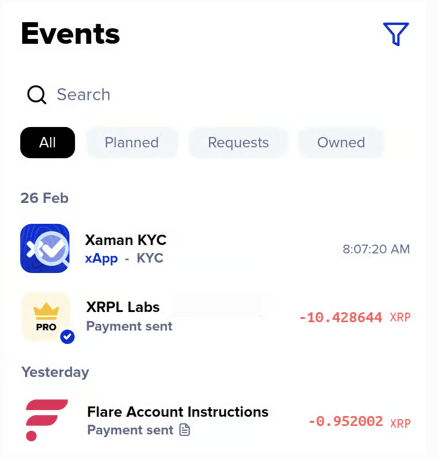

# How to use the Tangem backup xApp

Congratulations! If you are reading this you have decided to use the Tangem Backup xApp to create a backup for you XRP Ledger account.

This is a very wise decision! Creating a backup is one of the best ways to keep your crypto safe.

### **Understanding the process before you get started**

The Tangem Backup xApp is designed to simplify the process of creating a regular key between two Xumm (Tangem) cards. By doing this, you will effectively configure one of the cards as a "backup" to the other one. This is not a cloning process where you would make a duplicate a card, this it is about configuring one of the cards to be able to sign transactions on the other card's account. We'll discuss this concept further in the next section.

Don't worry if you can't quite understand it at first. This article will walk you through each step of the process and provide lots of pictures help. Together we'll get through this...😊

### What we are trying to achieve...

If you are reading this you probably have two Xumm (Tangem) cards and are wondering how to get started using them.

First off, the two cards appear differently...

<figure><figcaption></figcaption></figure>

...but they are identical in every way other than their appearance. They look differently so you can easily tell them apart. (And so you don't have to write on them to figure our which is which)

From now on we will refer to the cards as your **Primary card** and your **Signing Card**.&#x20;

It doesn't matter which one you choose to be your primary or signing card, but most people choose the _<mark style="color:blue;">blue</mark>_ card as the Primary card and the _transparent_ card as the Signing card.

When we are done with this process,

* &#x20;you will put the Primary card in a safe place&#x20;
* you will use the Signing card to sign transactions. If you plan to carry a card with you in your wallet/purse, this is the card you will carry.

### Getting started

Start by launching the [Tangem Backup xApp](https://xumm.app/detect/xapp:xumm.tangem-backup) by pressing  then choosing 

**Notes**

We understand that you might have additional questions regarding this topic so you are welcome to contact us any time via the <mark style="color:blue;">**Xumm Support xApp**</mark> in Xumm or you can simply scan this QR code with Xumm and be directed there automatically.

<figure><figcaption></figcaption></figure>
