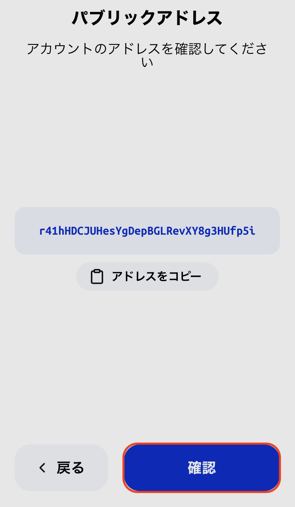

# Xumm タンジェムカードのインポート方法

## **Xaman タンジェム（Tangem）カードの追加方法**

まず、Xamanのホーム画面で右上の「アカウント」を押す。

<figure><figcaption></figcaption></figure>

右上の「アカウント追加」を選択

<figure><figcaption></figcaption></figure>

「Tangemカードを追加する」を押す

<figure><figcaption></figcaption></figure>

カード内蔵のNFCチップをスキャンする（スマートフォンがケースに入っている場合はうまくスキャンできない場合があります。ケースを外して再度お試しください）

<figure><figcaption></figcaption></figure>

通知が出てきたら「アカウントの作成」を押す

<figure><figcaption></figcaption></figure>

もう一度スキャンする

<figure><figcaption></figcaption></figure>

この画面が出たら「検証」を押す

<figure><figcaption></figcaption></figure>

カードのスキャン後、アカウントのrアドレスが表示されたら確認

<figure><figcaption></figcaption></figure>

アカウントに任意の名前を設定し、「次へ」をタップ

<figure><figcaption></figcaption></figure>

カードを再度スキャンすると、アカウントのrアドレスが表示されるので「確認」を押す

<figure><figcaption></figcaption></figure>

これでXummタンジェムカードを利用したアカウント作成は完了です！🥳
